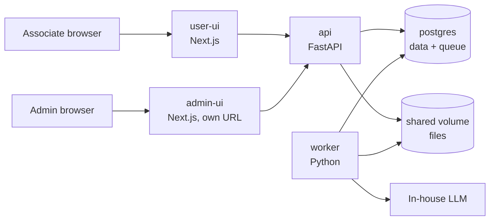
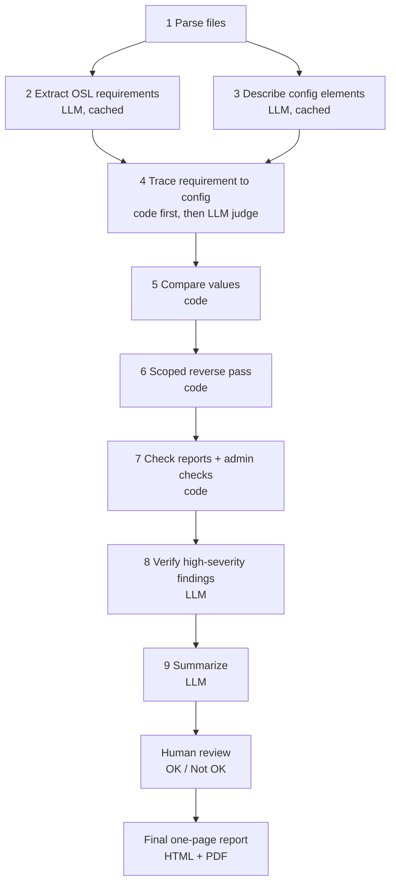

# Greenlight AI: Design Doc

2026-09-17 · @Someone

## Summary

The system reconciles three things automatically: the requirement spec (OSL, Word), the ETL configuration (JSON), and the output reports (Excel). It replaces the manual review of DIRT and distribution reports, which today can mean scanning a few thousand attributes by eye.

The core principle is **the LLM reads, code checks**. The LLM extracts requirements, judges whether a config element means the same thing as an OSL requirement, and writes the explanation. All value comparisons (sets, ranges, counts, report numbers) are deterministic Python, so results are exact, repeatable, and auditable.

The OSL is the source of truth. The system checks that every OSL requirement made it into the config, and then into the results, so nothing slips between the three.

A user fills a short web form, uploads the files, and submits. The run is queued and processed by a worker. The user then reviews the findings, marks each one OK or Not OK with comments, and generates a final one-page interactive HTML report that can be downloaded as PDF. Runs, configs, and tool stats are kept for 90 days.

## Scope and assumptions

These are the decisions and constraints the design is built on.

| Area | Assumption |
| --- | --- |
| Users | About 200 logged in, about 80 active at the same time, internal only |
| LLM | In-house, air-gapped, mid-size (about 20-40B). OpenAI-style and Anthropic-style APIs both supported |
| OSL | Word document, standard template, English text plus criteria tables |
| Config | JSON, schema varies by job |
| Reports | Excel, fixed layout: DIRT, field distribution, state distribution, counts, score distribution, cross tabs |
| Sample data | Second tab of the DIRT report. May contain real PII |
| Rule review | Extraction is automatic. Users can edit rules afterward and re-check |
| Login | None in v1, because hosting is internal. No per-person attribution. Runs are tracked by unique run ID, created date, and the config's last-modified date |
| Deployment | Docker (docker-compose) |
| Retention | Runs, files, and stats kept 90 days |
| Source of truth | The OSL. Config and reports are validated against it |
| Storage | Shared Docker volume for files. No MinIO |
| Look and feel | App UI matches the compare-file ui2 mock: colors, theme, text styles, and the config history screen. Final report follows the compare-file HTML report |
| Repo | github.com/rjoshig/vigilAI, structured like compare-file |
| LLM cost | Must stay low. Re-running the same inputs needs a logged reason |

**Out of scope for v1:** running the Spark ETL itself, editing configs inside the tool, and automatic fixes. The tool reports issues; people decide.

## Architecture

Five containers in one docker-compose file, plus the external LLM endpoint. Postgres doubles as the job queue and files sit on a shared Docker volume, so there is no Redis, broker, or object store to run.



The api only accepts requests and enqueues work. Workers do all parsing, LLM calls, checks, and report rendering.

| Service | Repo folder | Tech | Job |
| --- | --- | --- | --- |
| user-ui | user-ui/ | Next.js, TypeScript, Tailwind | New run form, run history, review screen, report viewer, config history. Theme matches the compare-file ui2 mock |
| admin-ui | admin-ui/ | Next.js, same theme | Separate app on its own URL, no login in v1. For artifact types and their meaning, delivery programmes, check definitions, compliance rules, aliases, usage stats |
| api | src/ | FastAPI, SQLAlchemy, Alembic, Pydantic | Uploads, run CRUD, enqueue, reviews, serve reports |
| worker | src/ | Python, Procrastinate (Postgres queue), python-docx, openpyxl, pandas, Jinja2, Playwright | The pipeline and PDF rendering. Scale by adding replicas |
| postgres | none | Postgres 16 | Metadata, requirements, findings, checks, stats, cache, job queue |

All Python code (api and worker) lives in one `src/` directory at the repo root. Its internal layout, and the rest of the repo structure, follow compare-file and are settled with Claude Code during repo setup.

The shared volume is mounted into api and worker. This works while everything runs on one host. If workers ever move to a second host, switch the volume to NFS or add an object store then.

## Processing pipeline

The pipeline is a three-way semantic reconciliation, not a 1:1 diff. Every OSL requirement is traced to the config and then to the reports, and every config element is traced back to the OSL. The LLM judges meaning; code compares the values.



Each stage writes status, duration, and token use to the database, so a failed run resumes from the last good stage.

1. **Parse files.** python-docx reads the OSL by heading and table. One fixed parser per report type reads the Excel files. The config JSON is split into logical blocks with their JSON paths.
2. **Extract OSL requirements (LLM).** One call per OSL section or table. Each requirement gets a type (see the schema section), normalized values, the source text, and a confidence score. State names become codes, ranges become intervals, lists become sets.
3. **Describe config elements (LLM).** One call per config block. The model states what the block does in the same requirement vocabulary: type, fields, normalized values, JSON path. This handles config schemas that vary by job.
4. **Trace requirement to config (LLM judge).** For each requirement, code shortlists candidate config elements by type and field alias. The LLM then answers one narrow question: does this element implement this requirement? It returns implemented, partial, contradicts, or not related, with a reason. It recognizes equivalents such as "reject age < 21" and "accept age >= 21".
5. **Compare values (code).** Once a requirement and a config element are linked, code does the math. Sets: missing and extra members. Intervals: boundary and operator differences. Lists: missing and extra attributes. Order: waterfall step sequence.
6. **Reverse pass.** The reverse pass is scoped, not exhaustive, because the OSL does not describe every detail of the extract process. Only three categories of config element are checked back against the OSL: filters and select criteria, model data such as attributes, and fixed compliance rules. Everything else in the config is ignored. Compliance rules work the other way round: each one must be present in the config even if the OSL never mentions it. The scoping is done in code from a category list kept in the admin-ui, with no LLM call.
7. **Check reports (code).** Each requirement type has a fixed report check. Geography: every state in the state distribution must be in the allowed set. Criteria: min and max in DIRT respect the interval. Attributes: the requested fields exist in DIRT and the field distribution. Counts: waterfall steps reconcile across reports. The cross-report checks defined in the admin-ui also run here (see Configurable checks).
8. **Verify (LLM).** Each high-severity finding goes back to the LLM with its evidence for a second opinion. Disagreements are kept but downgraded to Review. This cuts false positives. Optionally three **lenses** read it instead — delivery, compliance, requirements owner — independently, never each other's answers, with code merging them (ADR-034): all agree and it is verified; any disagreement sends it to a person with every reason. A lens changes confidence, never severity, and may raise a question from the same evidence as a Review item. Stage 8 also reads the requirements no report evidenced and says which look like obligations.
9. **Summarize (LLM).** The model gets the findings list only and writes the plain-English summary.

**After the pipeline.** The run moves to needs review. A person marks findings OK or Not OK, and only then is the final report generated. See Review and final report.

**Worked example.** OSL says include only consumers from IL and AZ. Stage 2 yields `geography include {IL, AZ}`. Stage 3 finds a config filter with `{IL, AZ, TX}`. Stage 4 links them. Stage 5 reports TX as extra in config. Stage 7 finds TX and NV in the state distribution report and flags both. The report shows one requirement row with three columns: OSL {IL, AZ}, config {IL, AZ, TX}, reports {IL, AZ, TX, NV}.

**LLM call volume.** The worst case is roughly 2-3 calls per requirement plus one per config block. Exact matches skip the judge call and cached results are reused, so typical runs use far fewer. See LLM cost controls.

**Re-check path.** When a user edits a requirement or a trace link, only stages 5-7 rerun. That takes seconds and needs no LLM call.

## Canonical rule schema

One common rule format is the key to the whole design. OSL rules and config rules are both converted into it, so comparing them becomes simple code.

A requirement is broader than a threshold rule. Each one has a `req_type`, and the type decides how values are normalized, compared, and checked in reports.

| req\_type | Example in OSL | Normalized as | Compared by | Report check |
| --- | --- | --- | --- | --- |
| criteria | Reject if age < 21 | Interval per field | Interval math | DIRT min / max |
| geography | Only IL and AZ | Set of state codes | Set difference | State distribution keys |
| value\_set | Exclude account types X, Y | Set of values | Set difference | Field distribution keys |
| attributes | Return these 40 fields | Set of field names | Set difference | DIRT attribute list |
| waterfall | Apply age, then score, then tag | Ordered steps | Sequence compare | Counts per step |
| quantity | Deliver at most 50,000 | Number | Equality | Counts report |
| other | Free-text instruction | Text | LLM judge only | Marked manual verify |

The JSON below is a `criteria` requirement. A `geography` requirement has the same envelope with `"values": ["IL", "AZ"]` and `"mode": "include"` in place of conditions.

```json
{
  "rule_id": "R-003",
  "source": "osl",
  "waterfall_step": 2,
  "applies_to": "accepts",
  "conditions": [
    {"field": "score", "operator": ">", "value": 755}
  ],
  "logic": "AND",
  "action": "accept",
  "else_action": "reject",
  "tag": null,
  "reject_reason": "LOW_SCORE",
  "source_ref": "OSL section 4.2, table 3, row 2",
  "source_text": "For all accepts, if score > 755 accept, else reject",
  "confidence": 0.93
}
```

| Field | Meaning |
| --- | --- |
| source | `osl`, `config`, or `user` (manually added or edited) |
| waterfall\_step | Order in the waterfall. Drives the count reconciliation |
| applies\_to | Which population the rule runs on: `all`, `accepts`, `rejects`, or a tag |
| conditions + logic | One or more field comparisons joined by AND / OR |
| operator | `<`, `<=`, `>`, `>=`, `=`, `!=`, `in`, `not_in`, `between`, `is_null`, `not_null` |
| action / else\_action | `accept`, `reject`, `tag`, or `pass` |
| source\_ref + source\_text | Where the rule came from. OSL location or config JSON path. Shown as evidence |
| confidence | LLM self-score. Below 0.7 is flagged for human review |

**Derived checks.** Each rule also produces the report expectations it implies. For the age example, rule `age < 21 -> reject` generates the check `accepts.age.min >= 21`. These derivations are fixed code per operator, not LLM output.

## Findings

A finding is one potential issue with a type, a severity, and links to its evidence. The interactive report is a view over the findings list.

| Type | Example | Severity |
| --- | --- | --- |
| Rule missing in config | OSL says reject age < 21; no matching config rule | High |
| Extra rule in config | Config filters on state; OSL does not mention it | Medium |
| Value mismatch | OSL says 755, config says 750 | High |
| Operator mismatch | OSL says `>`, config says `>=` | High |
| Waterfall order mismatch | Steps 2 and 3 swapped between OSL and config | High |
| Report violates rule | Accepts file has min age 19 | High |
| Count does not reconcile | Input 1,000,000; accepts + rejects = 999,412 | High |
| Cross-report disagreement | DIRT row count differs from counts report | Medium |
| Profile anomaly | Unexpected nulls, wrong type, mean far from prior runs | Low to Medium |
| Low-confidence extraction | Rule confidence below 0.7 | Review |
| Raised by a lens | One reader saw something in the same evidence the finding does not mention | Review |
| Coverage gap | A requirement no report evidenced that reads like an obligation | Review |

**Three-way findings.** A finding names which leg of the reconciliation broke: OSL vs config, config vs reports, or OSL vs reports. For set types it lists the exact members, for example "TX in config, not in OSL" and "NV in state distribution, not in OSL or config".

Every finding stores three evidence pointers: the OSL location and text, the config JSON path and value, and the report name, sheet, and cell. Where sample rows exist, it also stores the matching row numbers from the DIRT sample tab.

Users can mark a finding as **confirmed**, **false positive**, or **accepted risk**, with a note. This gives you a measure of tool accuracy over time.

## Review and final report

A run does not end with the pipeline. A person reviews the findings first, and only then is the final report produced.

1. The pipeline finishes and the run status becomes needs review.
2. The review screen shows the traceability matrix and the findings. Each finding offers three decisions — false positive, accepted risk, Not OK — and a comment box. An accepted risk always needs a comment, and so does Not OK on a high or review finding. Low-severity findings can be marked OK in bulk, as false positives.
3. Generate final report becomes active once the gate is satisfied (ADR-035, ADR-036): every high and every Review finding has a decision, and every requirement no report evidenced and every check that could not be evaluated has been **acknowledged**. An acknowledgement is not a decision that the delivery is fine; it is the record that the gap was seen before the report was frozen. A delivery programme may also ask for a **second approver**: when the reviewer waves through a `must` programme breach or a missing compliance rule, someone else signs before the run can be frozen. Off by default, and inert while login is off, since both people would be the same placeholder account.
4. The final report is one page of interactive HTML in the same format as the compare-file report. It shows the verdict, the counts, the Not OK items with their comments, and expandable detail.
5. The report is frozen. It is stored once and never regenerated, and generating it asks for a confirmation showing the finding counts, because the findings cannot be re-reviewed afterwards. PDF download is rendered from the stored HTML.

Review decisions and report downloads never call the LLM.

## Configurable checks (admin-ui)

Cross-report number checks are defined by admins as data, not code. The LLM helps write a check once; code runs it on every request at no token cost.

| Building block | What it is |
| --- | --- |
| Report template | A sample Excel uploaded for one report type, such as number flow or billing. It documents where values live |
| Named value | A pointer into a report: report type, sheet, and either a cell (H9) or a label lookup (the row where column A says "Billing count"). Each has a plain-English description. Label lookup is preferred because it survives inserted rows |
| Check | An expression over named values, plus severity, a message, and the reasoning behind it |
| Judgment check | For rules a formula cannot express. Holds an instruction and the list of named values the model may see. The LLM receives only those values and the instruction — never a report — and returns pass, fail, or review; code records the verdict and sets the severity (ADR-039). One model call per run in scope; use sparingly |

Example checks, using your cases:

| Check | Expression | Reasoning shown to users |
| --- | --- | --- |
| Billing not above delivered | `billing_count <= delivered_count` | Billing count must not be more than records delivered in the number flow report |
| Billing not below accepts | `billing_count >= accepts_count` | Billing count must not be less than the accepts count |
| Counts add up | `accepts_count + rejects_count == input_count` | Every input record ends as an accept or a reject |

**Authoring flow in the admin-ui**

1. Upload the sample reports.
2. Describe the rule in plain English, including the cells. For example: compare cells A, B, C in this report with cells H, I in fileb.xls; this is billing count and must not be less than accepts count.
3. The LLM proposes the named values and the expression. This is the only LLM call, and it happens once.
4. The admin corrects the proposal and tests it against the sample files.
5. Activate. Checks are versioned, can be disabled, and can apply to all customers or one.

At run time the worker loads the active checks for the report types present, resolves the named values, and evaluates the expressions. If a value cannot be found, the run reports "could not evaluate" as a finding; it never skips silently.

The admin-ui also holds the compliance rules, the reverse pass categories, the attribute aliases, and the list of masked columns.

## Data model

These Postgres tables cover runs, history, configs, checks, cache, and stats. Files themselves live on the shared volume; the database stores only their paths and hashes.

| Table | Key columns | Purpose |
| --- | --- | --- |
| users | id, name, email, password\_hash, role, is\_active | Empty and unused in v1. The provision for adding login later, to the admin-ui first |
| runs | id, user\_id, customer\_name, order\_number, configuration\_id, run\_date, notes, status, current\_stage, error, created\_at, finished\_at, expires\_at | One row per synthesis. Status: queued, running, needs\_review, finalized, failed. Carries an input\_fingerprint for duplicate detection, the config's last-modified date, and a rerun\_reason when it repeats earlier inputs |
| run\_files | id, run\_id, kind (osl, config, dirt, field\_dist, ...), filename, storage\_key, sha256, size\_bytes | Uploaded inputs and generated outputs |
| configs | id, configuration\_id, version, customer\_name, content (jsonb), sha256, created\_by, created\_at | Captured configs, versioned, copyable to new runs |
| rules | id, run\_id, version, source, rule (jsonb), confidence, edited\_by, edited\_at | Canonical rules from OSL, config, and user edits |
| findings | id, run\_id, rules\_version, type, severity, title, detail, evidence (jsonb), review\_status, review\_note | The issues shown in the report |
| run\_stages | id, run\_id, stage, status, started\_at, duration\_ms, error | Per-stage timing and resume point |
| llm\_calls | id, run\_id, stage, provider, model, prompt\_tokens, completion\_tokens, latency\_ms, retries, ok | Tool stats per LLM call |
| attribute\_aliases | id, canonical\_name, alias, customer\_name (nullable) | Maps field names across OSL, config, and reports |
| audit\_log | id, user\_id, action, run\_id, at | Who viewed, downloaded, or edited what |
| config\_elements | id, run\_id, json\_path, req\_type, element (jsonb), is\_technical | What each config block does, in requirement vocabulary |
| traces | id, run\_id, rule\_id, config\_element\_id, verdict, reason, confidence, edited\_by | Links between OSL requirements and config elements. Users can fix a wrong link, then re-check |
| report\_templates | id, report\_type, filename, storage\_path, notes | Sample Excel per report type, uploaded in the admin-ui |
| named\_values | id, name, report\_type, sheet, locator (jsonb: cell or label lookup), description | Pointers into reports that checks refer to by name |
| check\_definitions | id, name, version, kind (expression, judgment), expression, instruction, value\_names, reasoning, severity, scope, is\_active | Admin-defined cross-report checks, versioned |
| compliance\_rules | id, name, requirement (jsonb), scope, is\_active | Rules that must be present in every config in scope |
| llm\_cache | key (content hash + model + prompt version), stage, result (jsonb), created\_at, hits | Stage cache so identical content is never sent to the LLM twice |
| final\_reports | id, run\_id, html\_path, pdf\_path, verdict, generated\_by, generated\_at | The frozen one-page report per run |

**Notes**

- `runs.expires_at` defaults to created\_at + 90 days. The purge job deletes by this column and cascades to files on the shared volume.
- `configs` is kept separately from runs so a config can outlive the 90-day window if you choose. The "copy config" action reads from here.
- `rules.version` increments on each user edit. `findings.rules_version` records which version produced them, so old reports stay reproducible.
- Prompts and raw LLM responses are **not** stored by default because of PII. An env flag can enable it for debugging on synthetic data.

## LLM adapter

Switching provider or model is a `.env` change and a worker restart. No code changes.

```bash
LLM_PROVIDER=openai          # openai | anthropic
LLM_BASE_URL=http://llm.internal:8000/v1
LLM_API_KEY=changeme
LLM_MODEL=your-model-name
LLM_MAX_TOKENS=2000
LLM_TEMPERATURE=0
LLM_TIMEOUT_S=120
LLM_MAX_CONCURRENCY=4        # calls in flight per worker
LLM_LOG_PROMPTS=false        # keep false when data may hold PII
```

The pipeline only ever calls one interface:

```python
class LLMClient(Protocol):
    def complete(self, system: str, user: str,
                 schema: type[BaseModel] | None = None) -> LLMResult: ...
```

Two small implementations sit behind it. `OpenAIClient` posts to `/chat/completions`, which also covers vLLM, TGI, Ollama, and most in-house gateways. `AnthropicClient` posts to `/v1/messages`. Both use plain `httpx`, so there are no vendor SDKs to install in an air-gapped network. A factory picks the class from `LLM_PROVIDER`.

`LLMResult` returns text, parsed JSON, token counts, and latency. The adapter writes one `llm_calls` row per call, which is where the tool stats come from.

**Switching environments.** The same code runs everywhere; only `.env` differs.

| Environment | LLM\_PROVIDER | LLM\_BASE\_URL | LLM\_MODEL |
| --- | --- | --- | --- |
| Mac dev, local | openai | Ollama's OpenAI-compatible endpoint on localhost | A Gemma model |
| Mac dev, Claude | anthropic | Anthropic API | A Claude model |
| Tests and CI | mock | none | none. Returns canned JSON, no LLM needed |
| In-house production | openai or anthropic | Internal gateway | In-house model |

Developing against Gemma locally is useful: it is close in size to the production model, so prompts that work there should carry over.

**Making a mid-size model reliable**

- One OSL section or table per call. Small inputs, small outputs.
- Temperature 0, with 2-3 worked examples in every extraction prompt.
- JSON-only output, validated by Pydantic. On failure, retry with the validation error appended.
- If the serving stack supports guided or JSON-schema decoding (vLLM does), turn it on. It removes most format errors.
- Never ask the model to do arithmetic or compare numbers. That is code's job.
- Keep a golden set of 10-20 OSLs with known-correct rules. Run it whenever the model or prompts change and track extraction accuracy.

## LLM cost controls

Two rules keep token use sustainable: the same content is never sent to the LLM twice, and code is always tried first. This matters more if you later move to a larger, costlier model.

| Control | How it works |
| --- | --- |
| Run fingerprint | A hash of all input files plus the active check versions. A matching submission shows the existing report first. The user can still re-run, but must enter a reason, which is logged. The stage cache keeps that re-run cheap |
| Stage cache | Results are cached by content hash: OSL section to requirements, config block to element, requirement plus element to verdict. A new run where only the config changed reuses all the OSL work |
| Code first | Pairs that match exactly on type, field, and normalized value are linked by code. The LLM judge sees only the unclear pairs |
| Narrow verify | A second opinion is requested only for high-severity findings with low confidence |
| Checks cost nothing | Expression checks and all report checks run in code |
| Frozen reports | The final report and PDF are stored. Viewing and downloading never call the LLM |
| Review is free | OK, Not OK, comments, and re-check never call the LLM |
| Budget | `LLM_MAX_TOKENS_PER_RUN` in `.env`. A run that exceeds it stops and is flagged. Tokens per run and cache hit rate show on the admin dashboard |

Cache keys include the model name and the prompt version, so changing either one refreshes results. Cache entries hold no sample rows and expire with the 90-day retention.

## UI and report

Two apps share one theme. The look and feel matches the compare-file ui2 mock (colors, theme, text styles, config history), and a static ui-mock in the repo shows every screen to engineers before anything is built.

| App | Screen | What it does |
| --- | --- | --- |
| user-ui | New run | Form: customer name, order number, configuration ID, date, delivery programme (AM / AS / Archives / other), whether suppressions were applied (defaults to no), additional notes. Drag-and-drop for OSL, config JSON, and reports. Copy from a previous run. If the same inputs were already run, shows that report and asks for a reason before re-running |
| user-ui | Runs | History with filters. Queue position and live stage progress |
| user-ui | Review | Traceability matrix, coverage, and findings. Three decisions and a comment per finding. Edit a requirement or a link, then Re-check. Generate final report |
| user-ui | Final report | The frozen one-page HTML report. Download PDF. Clone run |
| user-ui | Explore a sample | The stored example of any artifact the tool accepts, read-only: a workbook cell by cell with its label, an OSL by section, a configuration by JSON path. With Train AI mode on, any of them can be pointed at to start an observation |
| user-ui | Observations | What this person has recorded in Train AI mode and what became of it. Only when the mode is on (ADR-021) |
| user-ui | Run stats | Stage timings, LLM calls, tokens, cache hits |
| user-ui | Config history | Captured configs by configuration ID and version, with created and last-modified dates. Copy one into a new run. Same layout as the config history in the compare-file ui2 mock |
| admin-ui | Tell the tool | One box: write what you want checked in your own words, and the model places it on the surface that already runs it, as a candidate in the ordinary queue. Background is offered to the screen that holds background; a sentence it cannot place comes back as a question and creates nothing (ADR-037) |
| admin-ui | Artifact types | Define which inputs the tool accepts — the OSL, the config, and each report — with a label, a meaning, an optional sample workbook, model guidance, and an on/off switch. Named values are defined here too |
| admin-ui | Delivery programmes | AM, AS, Archives, and a catch-all, each with standing instructions that reach the model as background (ADR-020) |
| admin-ui | Checks | Create, test, version, enable or disable cross-report checks |
| admin-ui | Compliance and scope | Must-have compliance rules and reverse pass categories |
| admin-ui | Reference data | Attribute aliases and masked columns |
| admin-ui | Settings | Every runtime setting with the layer it came from, its change history, and a model connection test (ADR-023) |
| admin-ui | Users | Accounts for both roles, created by an administrator; login ships off (ADR-022) |
| user-ui | Configuration notes | Standing notes on an ETL configuration, written from the new-run form or the config history; background for every future run of it (ADR-024) |
| admin-ui | Training | The observation queue, synthesis into candidate rules, replay, and approval into shadow (ADR-021) |
| admin-ui | Rules | Every rule whatever its origin, searchable, with its statistics and its lifecycle |
| admin-ui | Usage | Runs per day, tokens, cache hit rate, false-positive rate |

**Interactive HTML report**

There are two outputs. The review screen in the app is the detailed working view. The final report is one self-contained HTML page in the compare-file report format, generated after review, and it also opens offline. Both draw on the same findings data. The elements below appear in the review screen; the final report carries the header, the summary, the Not OK items with comments, and expandable detail.

- Header: customer, order, configuration ID, credit date, model used, and severity counts.
- AI summary: a short paragraph plus the top issues.
- Findings list: filter by severity and type. Click a finding to open a side panel with the OSL text, the config path and value, the report cell, and matching sample rows.
- Waterfall view: counts at each step, with breaks highlighted in red.
- Traceability matrix: one row per requirement with three columns (OSL, config, reports) and a status of match, mismatch, partial, missing, or extra. This is the main view.
- Coverage: how many requirements a report check actually compared, how many were traced but evidenced by nothing, how many were never traced, and how many can only be verified by hand, with the unevidenced ones listed and acknowledgeable. A report no check examined is a warning. The absence of a finding is not on its own a pass (ADR-035).
- Attribute explorer: searchable DIRT table (min, max, mean, nulls) with pass or fail per rule. This replaces scrolling through thousands of rows.

**PII in the report.** Sample rows are masked by default (for example SSN and name columns). With no login there is no unmask option in v1. The app, the HTML report, and the PDF all use masked values.

**PDF export.** The worker opens the same HTML in headless Chromium (Playwright) with a print stylesheet that expands all findings, then saves the PDF to the shared volume.

## API endpoints

A small REST API under `/api/v1`. FastAPI generates the OpenAPI spec and docs page automatically.

| Method and path | Purpose |
| --- | --- |
| POST /runs | Create run (multipart: form fields + files). If the input fingerprint matches, returns the existing run unless a rerun\_reason is supplied |
| GET /runs, GET /runs/{id} | List, status, current stage, queue position |
| GET /runs/{id}/requirements, PUT /runs/{id}/requirements | Read and edit requirements and trace links |
| POST /runs/{id}/recheck | Rerun the code stages only |
| GET /runs/{id}/findings, PATCH /findings/{id} | List findings. Set false positive / accepted risk / Not OK and a comment |
| GET /runs/{id}/coverage, POST /runs/{id}/coverage/acknowledge | What was checked and what was not; record that a person has seen a gap |
| POST /runs/{id}/finalize | Generate and freeze the final report |
| GET /runs/{id}/report, GET /runs/{id}/report.pdf | Final HTML and PDF |
| POST /runs/{id}/clone | New run prefilled from this one |
| GET /runs/{id}/stats | Stage timings, LLM calls, cache hits |
| GET /configs, GET /configs/{id} | Browse and copy captured configs |
| GET /runs/options | The upload slots and programmes the new-run form draws itself from |
| CRUD /admin/artifact-types, /admin/scopes | Which inputs exist and what they mean (ADR-020) |
| CRUD /admin/named-values, /admin/checks | Configurable checks |
| POST /admin/checks/draft | The LLM proposes a check from a plain-English description |
| POST /admin/checks/{id}/test | Run a check against the sample files |
| CRUD /admin/compliance-rules, /admin/aliases; GET /admin/usage | Other admin data |

Live progress uses simple polling of `GET /runs/{id}` every 3 seconds. That is plenty at this scale and avoids WebSocket setup.

## Security and PII

Because sample data may hold real PII, the design keeps PII away from the LLM and out of logs entirely. The LLM never needs sample rows to do its job.

- **LLM inputs are PII-free by design.** The model sees OSL text, config JSON, and findings (field names, thresholds, aggregate stats). Sample rows never enter a prompt.
- **Masking.** A configurable list of sensitive columns is masked when the sample tab is parsed. Unmasked values stay only in the original uploaded file.
- **Encryption.** TLS at the reverse proxy (nginx or Traefik). Encrypted Docker volumes for the files and for Postgres.
- **Access control.** With no login there are no enforced roles. All runs are visible to everyone on the internal network. Sample rows stay masked everywhere.
- **Audit.** Every report view, download, review decision, and requirement edit goes to `audit_log`.
- **Logging.** Application logs carry ids and counts only. `LLM_LOG_PROMPTS` stays false in production.
- **Retention.** A nightly job deletes runs past `expires_at`, their files on the shared volume, and their rules, findings, and stats. Aggregated usage stats (counts, tokens, latency by day) are kept long term since they hold no customer data.
- **Uploads.** Accept only .docx, .json, and .xlsx, with size limits and content-type checks. Office files are parsed, never executed; macros are ignored.

**No login in v1.** The tool is hosted on the internal network only, so there is no authentication and no enforced roles. The api keeps a single dependency where auth can be added later without touching the endpoints. There is no per-person attribution. Runs, review decisions, and re-run reasons are tied to the unique run ID with created and last-modified timestamps. The admin-ui is a separate app on its own URL, also without login for now. The users table and the single auth dependency in the api are the provision for adding login later.

Given PII is in play, confirm with your security or compliance team that storing the uploaded DIRT files for 90 days is acceptable, or shorten retention for that file type alone.

## Queueing, scale, and observability

The web tier is not the bottleneck; LLM throughput is. About 80 active users at once is light for Next.js and FastAPI on a single host. The queue protects the LLM by capping how many runs process at once.

- **Queue.** Procrastinate uses Postgres `LISTEN/NOTIFY` and row locks. Jobs survive restarts. Failed jobs retry with backoff up to 3 times, then the run is marked failed with the error shown in the UI.
- **Concurrency.** Start with 2-4 worker replicas and `LLM_MAX_CONCURRENCY=4`. Tune to what the in-house LLM can serve. Scale with `docker compose up --scale worker=N`.
- **Fairness.** A cap on queued runs per order number stops the queue from filling with repeats.
- **Expected run time.** Parsing and checks take seconds. LLM stages dominate: roughly 150-200 small calls per OSL. Plan for 5-15 minutes per run on a mid-size model, to be confirmed with a real OSL.
- **Idempotency.** Each stage checks `run_stages` before starting, so a retried job resumes instead of redoing LLM work.

**Tool stats captured**

| Level | Metrics |
| --- | --- |
| Per run | Queue wait, total duration, stage durations, rules extracted, findings by severity, final status |
| Per LLM call | Provider, model, prompt and completion tokens, latency, retries, success |
| Aggregate (admin dashboard) | Runs per day, p50/p95 duration, failure rate, tokens per day, JSON-validation failure rate, false-positive rate from finding reviews |

All of it sits in Postgres, so the admin dashboard is plain SQL. Add Prometheus and Grafana later only if operations asks for them.

## Build phases, risks, open questions

Set up the repo and a UI mock first, so engineers can see the target. Then build the pipeline as a command-line tool before the web app, because LLM extraction quality is the biggest risk.

| Phase | Deliverable | Rough effort |
| --- | --- | --- |
| 0. Repo setup | Greenlight AI repo structured like compare-file: CLAUDE.md, docs, phase docs, standards, git rules | Days |
| 1. UI mock | Static ui-mock of user-ui, admin-ui, and the final report, for engineer review | 1 week |
| 2. Pipeline core | CLI: files in, findings JSON out. Parsers, requirement schema, LLM adapter, cache, golden set on synthetic fixtures | 4-5 weeks |
| 3. Web app | docker-compose, new run, queue, history, review screen, stats | 3 weeks |
| 4. Admin-ui and checks | Templates, named values, checks, compliance rules, LLM-assisted authoring | 2-3 weeks |
| 5. Final report | One-page HTML in the compare-file format, freeze, quick PDF export | 1-2 weeks |
| 6. Hardening and in-house fit | PII masking, audit, retention, load test, adapt parsers to real samples in-house | 2 weeks |

Effort assumes 1-2 developers and is a starting estimate.

**Risks**

| Risk | Mitigation |
| --- | --- |
| Mid-size model misreads complex or nested rules | Chunked prompts, examples, schema validation, confidence flags, user edit + re-check, golden set regression |
| Config schema varies by job | LLM-assisted normalization, saved user corrections as examples, alias table. Add a code parser for any config style that becomes common |
| Field names differ across OSL, config, and reports | Attribute alias table, seeded from a data dictionary if one exists |
| False positives erode trust | Severity levels, review status, track false-positive rate, tune checks |
| PII exposure | No sample rows in prompts, masking, audit log, no prompt logging |

**Open questions**

- [ ] Can you share one sanitized set (OSL, config JSON, DIRT and other reports)? The parsers and prompts depend on the real layouts.
- [ ] Which in-house model and serving stack (vLLM, TGI, other)? Does it support JSON-schema guided decoding? What context length?
- [ ] Is there an attribute data dictionary to seed the alias table?
- [ ] Should users see only their own runs, or everyone's on their team?
- [ ] Is 90-day storage of DIRT files containing PII approved, or should those expire sooner?
- [x] Do you want a comparison against the same customer's previous run (drift in counts and means)? **Built** (Phase 6.9, ADR-030): findings, requirements and configuration compared against the previous finalized run of the same configuration.

* [ ] Are the fixed compliance rules a list you maintain in the admin-ui, or do they come from another source?
* [ ] Must every high-severity finding have a decision before the final report can be generated?
* [ ] Confirm that "last modified" means a timestamp inside the config JSON, not the upload time of the file.
