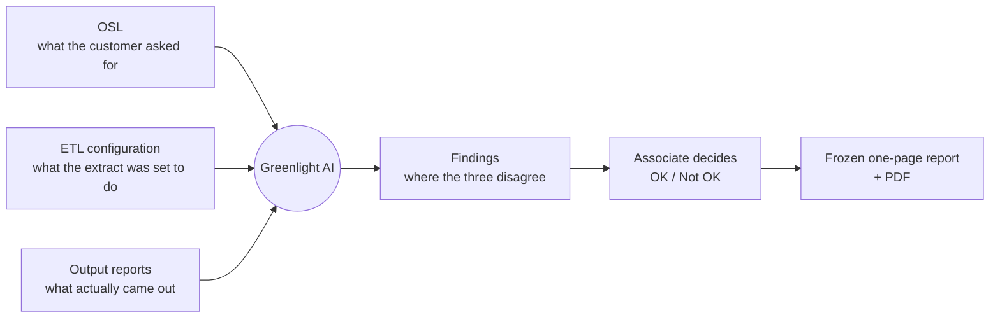
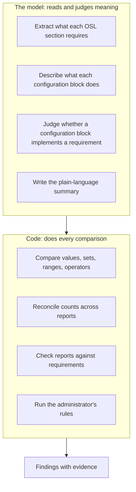
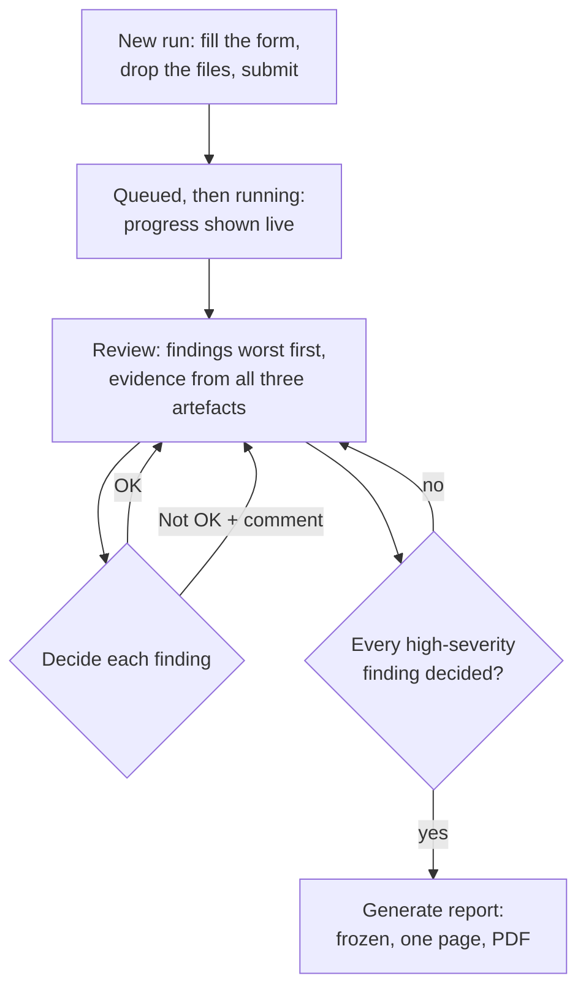
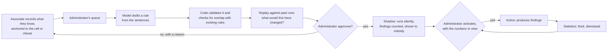
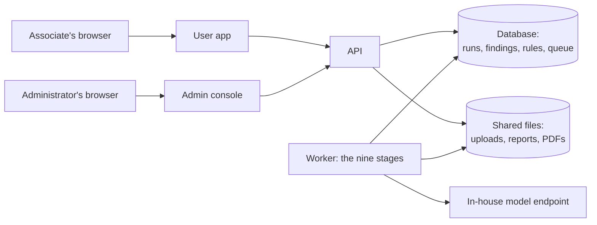
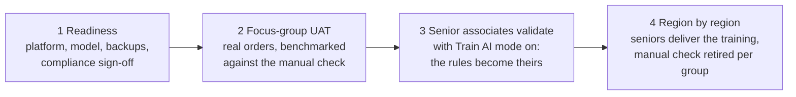

# Greenlight AI — Design brief for presentations and documents

**Purpose of this file.** A self-contained description of what Greenlight AI is, how it
works, why it was built the way it was, and what it changes for the people who use
it. Written to be pasted into a chat or a document tool to produce slide decks,
design documents, and management briefings. Everything here is at the level a user or
a manager needs; engineering detail lives in the repository. Diagrams are in Mermaid
so they render in most tools and can be redrawn in any.

**As of:** 2026-09-19. The tool is built through phase 6.4 and is ahead of its first
UAT. Timing figures in section 8 are expected values to be confirmed in UAT, not
measurements.

---

## 1. The problem, in one paragraph

Every credit-data delivery is checked by a person before it goes to the customer.
The check reconciles three things: what the customer asked for (the **OSL**, a Word
document called the Order Specification Letter), what the extract was configured to
do (the **ETL configuration**, a JSON file from the Solution Canvas), and what
actually came out (the **reports**, Excel workbooks: a data-integrity report called
the DIRT, field and state distributions, counts, billing). Today an associate reads
all three, holds them in their head, and looks for disagreements. It takes about three
to five hours per order, it depends on who is doing it, and a miss reaches the
customer.

## 2. What Greenlight AI does

It reads the OSL, works out what it requires, traces every requirement into the
configuration and then into the reports, and shows the associate a list of
**findings**: the places where the three disagree. The associate decides each finding,
OK or Not OK, and the tool produces a frozen one-page report with a PDF. The judgement
stays with the person; the reading and the comparing move to the tool.

## 3. The one design rule that everything else follows

**The model reads and judges meaning. Code does every comparison.**

A language model is good at reading a sentence like "deliver only accounts in the
following states" and understanding that it is a geography requirement. It is not
reliable at comparing two lists, adding counts, or checking that 755 is above 750. So
the tool never asks it to. The model extracts what a document means into structured
data; deterministic code compares the data. The result is that every finding is
exact, repeatable, and explainable: the same inputs always produce the same findings,
and each finding shows the evidence from all three artefacts side by side.

**Why this matters to a manager:** the tool's answers are auditable. A finding is not
"the AI thinks something is wrong"; it is "the OSL says X, the configuration says Y,
the report shows Z, and here are the three cells". That is what makes it usable for
sign-off.

## 4. How a run works

Nine stages, run by a background worker after the associate submits. The associate
does nothing until the run reaches **Needs review**.

What the stages catch, in plain terms:

| Stage | Catches |
| --- | --- |
| Trace and compare | A requirement in the OSL that the configuration does not implement, or implements with a different value or operator. |
| Reverse pass | Something in the configuration the OSL never asked for: an extra filter, an extra state. |
| Check reports | A report that does not satisfy a requirement: a state that should not be there, counts that do not reconcile down the waterfall, a billing figure above the delivered figure. |
| Verify | A second look at each finding, so a shaky extraction is flagged for review rather than presented as fact. |

## 5. What the associate sees

Three details that shape the experience:

- **The report is frozen.** Generated once, stored, never regenerated. What was signed
  off is what stays on record.
- **High-severity findings cannot be bulk-decided.** Each one is a deliberate click.
  Low-severity ones can be.
- **The same inputs are never run twice by accident.** The tool hashes every file; if
  an identical set was already run, it shows that run and asks for a reason.

## 6. How it gets better: Train AI mode

The rules a tool ships with never match how a team actually works. So the people who
know the work teach it, with a person at every gate.

Why it is built this way:

- **Anchored, not just written.** "This field is never blank" means nothing without
  which field. The associate clicks the cell or the clause and the note carries it.
- **Nothing activates without a person.** The model proposes; a human approves.
- **Shadow before live.** A new rule runs silently until its precision is known, so it
  cannot flood reviewers with false positives on day one.
- **Nothing is ever deleted.** What people said, what the model made of it, and who
  approved what is kept. A rule can be switched off, or deleted and restored for six
  months, but never lost.
- **Configuration notes.** A note on an ETL configuration id, written once, reaches
  the model as background on every future run of that configuration, and can be
  turned into a rule scoped to that configuration alone.

## 7. What an administrator controls, without engineering

Everything below changes from a screen and takes effect on the next run, with no
deployment and no restart.

| Area | What |
| --- | --- |
| Inputs | Which report types the tool accepts, what each means, up to three sample layouts per type, and a switch to hide a type from every user at once. |
| Programmes | Account Monitoring, Account Solicitation, Archives, Other: each with standing instructions that reach the model as background. |
| Rules | Every rule the tool holds, whatever its origin, searchable, with how often it fires and how often it is dismissed. Enable, disable, delete, restore. |
| Training | The queue of what associates wrote; synthesis; approval; activation. |
| Settings | The model provider and key, login rules, throughput limits, upload size, retention. Each shows where its value came from. |
| Accounts | Users and administrators, when login is on. |

**Why this matters:** the tool fits the work as the work changes, in days rather than
release cycles, and the people who understand the deliveries are the ones shaping it.

## 8. What changes for the associate: time and effort

Today's manual check is about three to five hours per order. The expected shape with
Greenlight AI is below. These are design targets, to be confirmed by the UAT benchmark in
the rollout plan; the honest claim before UAT is the shape of the change, not the
exact numbers.

| Step | Today | With Greenlight AI | Who is busy |
| --- | --- | --- | --- |
| Gather the three files and read them | 1–2 hours | 5 minutes to fill the form and drop the files | Associate, briefly |
| Reconcile OSL, configuration, and reports | 2–3 hours, by eye | 5–15 minutes, unattended | The tool |
| Decide what is wrong and write it up | included above | 20–45 minutes reviewing findings with evidence in front of them | Associate |
| Produce the report | 15–30 minutes | Seconds; one page, frozen, with PDF | The tool |
| **Associate's time per order** | **3–5 hours** | **about 30–60 minutes** | |

```mermaid
gantt
    title Associate time per order (expected, to be confirmed in UAT)
    dateFormat X
    axisFormat %s
    section Today
    Read and gather           :a1, 0, 90
    Reconcile by eye          :a2, 90, 240
    Write up and report       :a3, 240, 270
    section With Greenlight AI
    Submit                    :b1, 0, 5
    Tool runs (unattended)    :b2, 5, 20
    Review findings           :b3, 20, 55
    Generate report           :b4, 55, 57
```

Beyond time:

- **Consistency.** Two associates checking the same order get the same findings.
- **Coverage.** Every requirement is traced, every time. A tired reader skips; code
  does not.
- **Auditability.** Every finding carries its evidence, every decision carries a
  name, and the frozen report is the record.
- **Fewer misses reaching the customer**, which is the number that matters and the
  one the UAT benchmark measures directly: findings against the manual outcome, on
  real orders.

## 9. Why certain choices were made

| Choice | Why |
| --- | --- |
| The model never compares or computes | Comparisons by a model are unreliable and unexplainable; by code they are exact and auditable. |
| The OSL is the source of truth | The customer's requirement is what the delivery is measured against; the configuration and reports are validated against it, never the other way round. |
| Nothing personal ever reaches the model | Sample rows are masked at parse time, a tripwire refuses any prompt that looks like it carries personal data, and an associate's note is refused at save if it does. |
| Identical content is never sent to the model twice | A cache keyed on content means re-runs and repeated sections cost nothing and answer identically. |
| One relational database, no extra infrastructure | SQLite for a laptop, Postgres for scale, chosen by one setting. Nothing else to run. |
| Login is optional and off by default | The tool works on an internal network with no accounts; when accounts are wanted, every action already carries a name. |
| Rules are data an administrator edits | The people who understand the deliveries shape the checks, without a release. |
| A learned rule starts in shadow | Its precision is unknown until it meets real data; a false-positive flood costs trust that takes months to earn back. |
| The report is frozen | What was signed off is what stays on record. |

## 10. Where it runs

Five containers on the internal network: the user app, the admin console on its own
URL, the API, a background worker, and the database. The model is an in-house
endpoint; the tool talks to it over a plain HTTP interface with no vendor library, so
the provider can change without a code change.

## 11. How it reaches the teams

Four stages, each with an exit gate rather than a date.

Ownership sits with a product owner in Global Delivery, a technical owner in
engineering, and one administrator per region. Support runs in three tiers, from the
senior associates on the floor to engineering, with escalation severities and
response times written down. Acceptance is a signature per programme per region,
against a precision and recall floor measured on real orders.

## 12. Where the build stands

| Done | Still to do |
| --- | --- |
| The pipeline, the two apps, the frozen report and PDF | Fitting the parsers to the real file layouts, on the machine that holds them |
| Configurable checks, rules, programmes, and settings from the admin console | The in-house model benchmark on the golden set |
| Optional login and full attribution | The first UAT and its benchmark |
| Train AI mode end to end, with shadow rules | Compliance sign-off on retention and personal data |
| Training documents and the rollout plan | Region-by-region rollout |

## 13. Glossary for a general audience

| Term | Meaning |
| --- | --- |
| OSL | Order Specification Letter: the customer's requirement, a Word document. The source of truth. |
| ETL configuration | The JSON file that told the extract what to do. Identified by the Solution Canvas config number. |
| DIRT | The data-integrity report: per-field statistics for the delivered data. |
| Finding | One place where the OSL, the configuration, and the reports disagree, with its evidence. |
| Frozen report | The one-page sign-off document, generated once and never changed. |
| Train AI mode | The mode in which associates record what they know so it can become rules, with an administrator approving every one. |
| Shadow rule | A rule that runs silently and is counted but shown to nobody, until its precision is known. |
| Configuration note | A standing note on an ETL configuration that reaches the model as background on every future run of it. |
