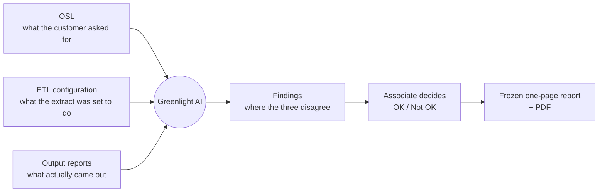
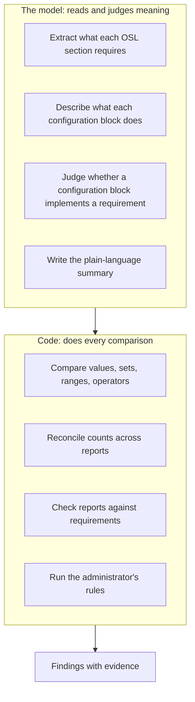
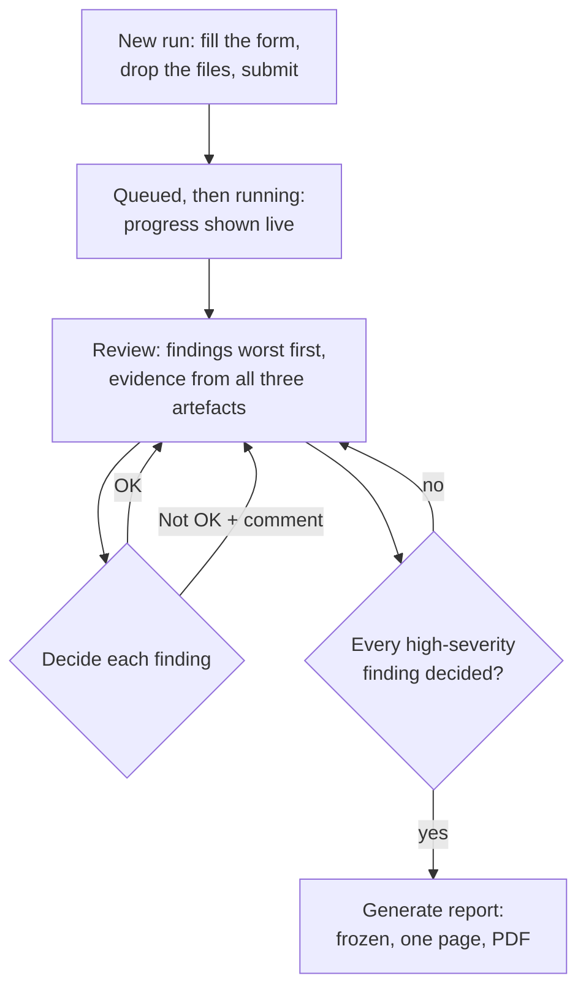
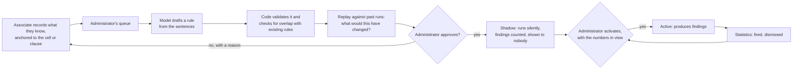
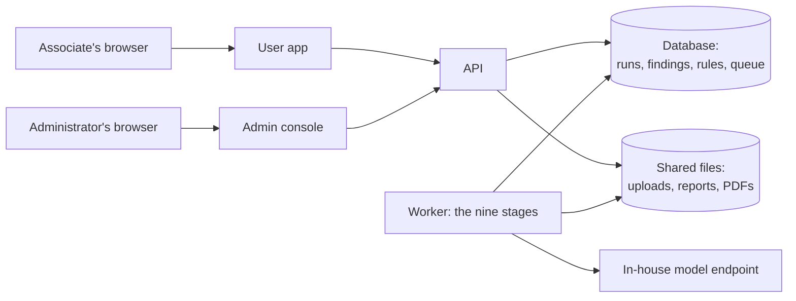
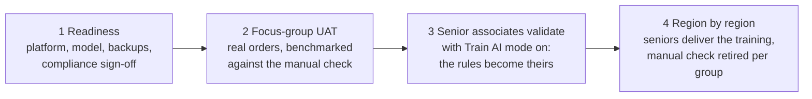

# Greenlight AI — Design brief for presentations and documents

**Purpose of this file.** A self-contained description of what Greenlight AI is, how it
works, why it was built the way it was, and what it changes for the people who use
it. Written to be pasted into a chat or a document tool to produce slide decks,
design documents, and management briefings. Everything here is at the level a user or
a manager needs; engineering detail lives in the repository. Diagrams are in Mermaid
so they render in most tools and can be redrawn in any.

**As of:** 2026-09-20. The tool is built through phase 6.13, with phase 6.14 part
built, and is ahead of its first UAT. It has been run end to end against a real
commercial model, not only the scripted stand-in. Timing figures in section 9 are
expected values to be confirmed in UAT, not measurements.

---

## 1. The problem, in one paragraph

Every credit-data delivery is checked by a person before it goes to the customer.
The check reconciles three things: what the customer asked for (the **OSL**, a Word
document called the Order Specification Letter), what the extract was configured to
do (the **ETL configuration**, a JSON file from the Solution Canvas), and what
actually came out (the **reports**, Excel workbooks: a data-integrity report called
the DIRT, field and state distributions, counts, billing). Today an associate reads
all three, holds them in their head, and looks for disagreements. It takes about three
to five hours per order, it depends on who is doing it, and a miss reaches the
customer.

## 2. What Greenlight AI does

It reads the OSL, works out what it requires, traces every requirement into the
configuration and then into the reports, and shows the associate a list of
**findings**: the places where the three disagree. The associate decides each finding,
OK or Not OK, and the tool produces a frozen one-page report with a PDF. The judgement
stays with the person; the reading and the comparing move to the tool.

## 3. The one design rule that everything else follows

**The model reads and judges meaning. Code does every comparison.**

A language model is good at reading a sentence like "deliver only accounts in the
following states" and understanding that it is a geography requirement. It is not
reliable at comparing two lists, adding counts, or checking that 755 is above 750. So
the tool never asks it to. The model extracts what a document means into structured
data; deterministic code compares the data. The result is that every finding is
exact, repeatable, and explainable: the same inputs always produce the same findings,
and each finding shows the evidence from all three artefacts side by side.

**Why this matters to a manager:** the tool's answers are auditable. A finding is not
"the AI thinks something is wrong"; it is "the OSL says X, the configuration says Y,
the report shows Z, and here are the three cells". That is what makes it usable for
sign-off.

## 4. How a run works

Nine stages, run by a background worker after the associate submits. The associate
does nothing until the run reaches **Needs review**.

What the stages catch, in plain terms:

| Stage | Catches |
| --- | --- |
| Trace and compare | A requirement in the OSL that the configuration does not implement, or implements with a different value or operator. |
| Reverse pass | Something in the configuration the OSL never asked for: an extra filter, an extra state. |
| Check reports | A report that does not satisfy a requirement: a state that should not be there, counts that do not reconcile down the waterfall, a billing figure above the delivered figure. |
| Verify | A second look at each finding, so a shaky extraction is flagged for review rather than presented as fact. |

## 5. What the associate sees

Three details that shape the experience:

- **The report is frozen.** Generated once, stored, never regenerated. What was signed
  off is what stays on record.
- **High-severity findings cannot be bulk-decided.** Each one is a deliberate click.
  Low-severity ones can be.
- **The same inputs are never run twice by accident.** The tool hashes every file; if
  an identical set was already run, it shows that run and asks for a reason.
- **The artifacts are checked against the form before anything is validated.** An ETL
  configuration declares its own configuration number and the customer it was built
  for. If either disagrees with what was typed, the run stops before a single question
  is put to the model, shows both values side by side, and waits. One sentence saying
  why — four common reasons are a single click — and it runs. Nothing is re-uploaded,
  and the waiver is kept and printed on the final report, so whoever signs it can see
  that the question was asked and who answered it.

## 6. How it gets better: Train AI mode

The rules a tool ships with never match how a team actually works. So the people who
know the work teach it, with a person at every gate.

**The model does the paperwork; the specialist does the judging.** An associate writes
a sentence in their own words. From that, the model produces a short, structured brief
for the administrator to read: what it thinks the rule is, which existing rules it
would overlap, which past runs it would have fired on and what it would have changed,
and where it should apply. The specialist is not asked to write a rule or to read code.
They are asked to agree or disagree with a one-page case that the model has already
assembled — which is the difference between an expert review that takes minutes and one
that never happens.

Why it is built this way:

- **Anchored, not just written.** "This field is never blank" means nothing without
  which field. The associate clicks the cell or the clause and the note carries it.
- **Nothing activates without a person.** The model proposes; a human approves.
- **Shadow before live.** A new rule runs silently until its precision is known, so it
  cannot flood reviewers with false positives on day one.
- **Nothing is ever deleted.** What people said, what the model made of it, and who
  approved what is kept. A rule can be switched off, or deleted and restored for six
  months, but never lost.
- **Configuration notes.** A note on an ETL configuration id, written once, reaches
  the model as background on every future run of that configuration, and can be
  turned into a rule scoped to that configuration alone.

### How the associates teach it

**Training is a switch, and it is meant to be turned off.** Train AI mode is on or off,
set by an administrator from a screen. While it is off the collecting controls are not
there at all — the tool validates exactly as it does today and nothing is gathered.
While it is on, three things an associate can do become available, and every one of
them is marked so the person knows what they type is being collected.

That switch matters for the shape of the programme, not only for privacy. Teaching a
tool is front-loaded work: the first months are where the rules that matter get
written. Once a configuration is being validated to the standard the team wants,
training can simply be switched off for it, and the rules already approved keep
running. Nobody has to maintain a training effort forever to keep the accuracy that
effort bought.

- **From a finding.** Every finding on the review screen has a "What should this
  check?" control. The associate writes, in plain words, what they expected and how
  serious a miss is; the tool attaches what they were looking at, the finding and
  its cell, clause, or configuration path, so the note is anchored to a fact rather
  than floating. This is the most valuable path: a finding someone dismissed becomes
  a lesson instead of a review note nobody reads again.
- **From a run.** The same control on the run page, for something the tool did not
  check at all: "the account status column is never blank for this customer", "clause
  4.2 is what the first score band answers to".
- **Against a configuration.** A standing note on an ETL configuration id, written
  once from the new-run form or the config history. It reaches the model as
  background on every future run of that configuration, and it works whether or not
  Train AI mode is on, because it is guidance rather than training.

Each note carries how far it should apply: this customer, this programme, or
everywhere. The narrowest that fits is the default, because most false positives
come from a rule that was true of most deliveries and not all.

Nothing an associate writes runs. It goes to the administrator's queue, where the
model drafts a rule from it, code checks the draft and looks for overlap with rules
that already exist, a replay shows what it would have changed on past runs, and a
person approves it into shadow. In shadow the rule runs on every delivery and its
findings are counted but shown to nobody; the administrator activates it when the
numbers say it has earned its place. The associate sees what became of every note
they wrote, with the reason if it was turned down.

## 7. The advantages, in the order they matter

**1. It gets better at your work, not at work in general.** Every tool of this kind
ships with rules that approximate how some team somewhere operates. This one starts
with the checks the design called for and then learns the rest from the people doing
the deliveries — the exceptions, the customer-specific habits, the thing that is only
ever wrong on one programme. That knowledge currently lives in a handful of
experienced heads and leaves when they do.

**2. A specialist gates every rule, and reads a brief rather than a specification.**
Nothing an associate writes runs. The model turns their sentence into a structured
case — the proposed rule, what it overlaps, what it would have changed on past runs —
and a specialist approves, rejects with a reason, or edits it. The expert's time is
spent on the judgement only they can make, not on the transcription anyone could.

**3. A new rule cannot embarrass you on its first day.** An approved rule runs in
**shadow**: it is evaluated on every delivery, its hits are counted, and no reviewer
sees them. The administrator activates it once the numbers show what it actually
catches and how often it is wrong. This is why the team can afford to be generous
about what gets proposed.

**4. Training is a switch, and switching it off keeps what you learned.** Train AI
mode is on or off. Off, the collecting controls do not exist and the tool behaves
exactly as it always did. The rules already approved keep running. So the effort is
front-loaded: teach it until a configuration reaches the accuracy you want, then stop,
and keep the accuracy.

**5. No engineering in the loop.** This is the one that changes the economics. Adding
a report type, changing what a document means, writing a rule, scoping it to one
programme or one configuration, adjusting a threshold, retiring a check — all of it is
a screen, takes effect on the next run, and needs no code change, no release, no
deployment window and no ticket raised with a technology team. The only work that
needs engineering is work nobody has met yet: a genuinely new file format. Everything
else moves at the speed of the people who understand the deliveries.

**6. Every answer can be traced to its reason.** A finding names the clause, the
configuration path and the report cell it came from. A rule names who approved it and
from whose observation. A waived artifact mismatch names who waived it and why. The
frozen report carries all of it. Nothing in the tool asks to be trusted.

**7. The model never decides anything.** It reads and it judges meaning; every
comparison of a value, a set, a range, a count or a sequence is made by code. That is
not a limitation to be lifted later — it is what makes the results reproducible,
explainable to a regulator, and identical on two runs of the same inputs.

## 8. What an administrator controls, without engineering

Everything below changes from a screen and takes effect on the next run, with no
deployment and no restart.

| Area | What |
| --- | --- |
| Submission | Which fields the tool checks the artifacts against before a run starts, and what this delivery calls them — a credit date written "as-of date" on one customer's reports and "cycle date" on another's. |
| Inputs | The OSL (Word or PDF), the ETL configuration, and each report type in their own tabs; what each means; up to three sample layouts per type per programme; every definition kept in ten versions with revert; a switch to hide a type from every user at once. |
| Meaning | The mapping interview: the model reads the sample OSL against the sample configuration and reports and proposes, per requirement, where it answers to; an administrator confirms, and code turns the confirmed rows into checks that run in shadow first. Global, and per programme. |
| Programmes | Account Monitoring, Account Solicitation, Archives, Other: each with standing instructions, keywords, and rules of its own with a strictness the model never grades; checks and compliance rules can be scoped to one programme. |
| Rules | Every rule the tool holds, whatever its origin, searchable, with how often it fires and how often it is dismissed. Enable, disable, delete, restore. |
| Training | The queue of what associates wrote; synthesis; approval; activation. |
| Settings | The model provider and key, login rules, throughput limits, upload size, retention, the default theme and its lock. Each shows where its value came from. |
| Accounts | Users and administrators, when login is on. |

**Why this matters:** the tool fits the work as the work changes, in days rather than
release cycles, and the people who understand the deliveries are the ones shaping it.
Nothing in that table needs a developer, a release, a deployment window or a ticket to
a technology team. The dependency a tool like this usually creates — every adjustment
queued behind somebody else's sprint — is not there, which is what lets it keep pace
with customers whose requirements change faster than release cycles do.

## 9. What changes for the associate: time and effort

Today's manual check is about three to five hours per order. The expected shape with
Greenlight AI is below. These are design targets, to be confirmed by the UAT benchmark in
the rollout plan; the honest claim before UAT is the shape of the change, not the
exact numbers.

| Step | Today | With Greenlight AI | Who is busy |
| --- | --- | --- | --- |
| Gather the three files and read them | 1–2 hours | 5 minutes to fill the form and drop the files | Associate, briefly |
| Reconcile OSL, configuration, and reports | 2–3 hours, by eye | 5–15 minutes, unattended | The tool |
| Decide what is wrong and write it up | included above | 20–45 minutes reviewing findings with evidence in front of them | Associate |
| Produce the report | 15–30 minutes | Seconds; one page, frozen, with PDF | The tool |
| **Associate's time per order** | **3–5 hours** | **about 30–60 minutes** | |

```mermaid
gantt
    title Associate time per order (expected, to be confirmed in UAT)
    dateFormat X
    axisFormat %s
    section Today
    Read and gather           :a1, 0, 90
    Reconcile by eye          :a2, 90, 240
    Write up and report       :a3, 240, 270
    section With Greenlight AI
    Submit                    :b1, 0, 5
    Tool runs (unattended)    :b2, 5, 20
    Review findings           :b3, 20, 55
    Generate report           :b4, 55, 57
```

Beyond time:

- **Consistency.** Two associates checking the same order get the same findings.
- **Coverage.** Every requirement is traced, every time. A tired reader skips; code
  does not.
- **Auditability.** Every finding carries its evidence, every decision carries a
  name, and the frozen report is the record.
- **Fewer misses reaching the customer**, which is the number that matters and the
  one the UAT benchmark measures directly: findings against the manual outcome, on
  real orders.

## 10. Why certain choices were made

| Choice | Why |
| --- | --- |
| The model never compares or computes | Comparisons by a model are unreliable and unexplainable; by code they are exact and auditable. |
| The OSL is the source of truth | The customer's requirement is what the delivery is measured against; the configuration and reports are validated against it, never the other way round. |
| Nothing personal ever reaches the model | Sample rows are masked at parse time, a tripwire refuses any prompt that looks like it carries personal data, and an associate's note is refused at save if it does. |
| Identical content is never sent to the model twice | A cache keyed on content means re-runs and repeated sections cost nothing and answer identically. |
| One relational database, no extra infrastructure | SQLite for a laptop, Postgres for scale, chosen by one setting. Nothing else to run. |
| Login is optional and off by default | The tool works on an internal network with no accounts; when accounts are wanted, every action already carries a name. |
| Rules are data an administrator edits | The people who understand the deliveries shape the checks, without a release. |
| A learned rule starts in shadow | Its precision is unknown until it meets real data; a false-positive flood costs trust that takes months to earn back. |
| The report is frozen | What was signed off is what stays on record. |

## 11. Where it runs

Five containers on the internal network: the user app, the admin console on its own
URL, the API, a background worker, and the database. The model is an in-house
endpoint; the tool talks to it over a plain HTTP interface with no vendor library, so
the provider can change without a code change.

## 12. How it reaches the teams

Four stages, each with an exit gate rather than a date.

Ownership sits with a product owner in Global Delivery, a technical owner in
engineering, and one administrator per region. Support runs in three tiers, from the
senior associates on the floor to engineering, with escalation severities and
response times written down. Acceptance is a signature per programme per region,
against a precision and recall floor measured on real orders.

## 13. Where the build stands

| Done | Still to do |
| --- | --- |
| The pipeline, the two apps, the frozen report and PDF | Fitting the parsers to the real file layouts, on the machine that holds them |
| Configurable checks, rules, programmes, meaning, versions and settings from the admin console | The in-house model benchmark on real files, on the target machine |
| Optional login and full attribution | The first UAT and its benchmark |
| Train AI mode end to end, with shadow rules; an administrator's own library of worked examples for the model | Compliance sign-off on retention and personal data |
| Coverage of every requirement, a fail-closed sign-off gate, and three independent second opinions merged by code | Region-by-region rollout |
| One place an administrator describes what to check in their own words, and one vocabulary for where a rule applies | A screen for the field-label table; the remaining field markers and tooltips |
| The artifacts checked against the submission before any model call, waived with a reason and printed on the report | Moving the credit-date comparison into that pre-flight |
| Training documents and the rollout plan; delivery drift; four themes, locked by default | |
| Proven on a real commercial model end to end: a full run in 33 seconds and about five cents, reproducing the planted findings exactly | |

## 14. Glossary for a general audience

| Term | Meaning |
| --- | --- |
| OSL | Order Specification Letter: the customer's requirement, a Word document. The source of truth. |
| ETL configuration | The JSON file that told the extract what to do. Identified by the Solution Canvas config number. |
| DIRT | The data-integrity report: per-field statistics for the delivered data. |
| Finding | One place where the OSL, the configuration, and the reports disagree, with its evidence. |
| Frozen report | The one-page sign-off document, generated once and never changed. |
| Train AI mode | The mode in which associates record what they know so it can become rules, with an administrator approving every one. |
| Shadow rule | A rule that runs silently and is counted but shown to nobody, until its precision is known. |
| Configuration note | A standing note on an ETL configuration that reaches the model as background on every future run of it. |
| Artifact match check | The comparison, made by code before any question is put to the model, between what was typed on the form and what the uploaded configuration declares about itself. |
| Held run | A run whose artifacts disagree with the form. Its files are stored and nothing is lost; it starts as soon as somebody says, in one sentence, why they belong together. |
