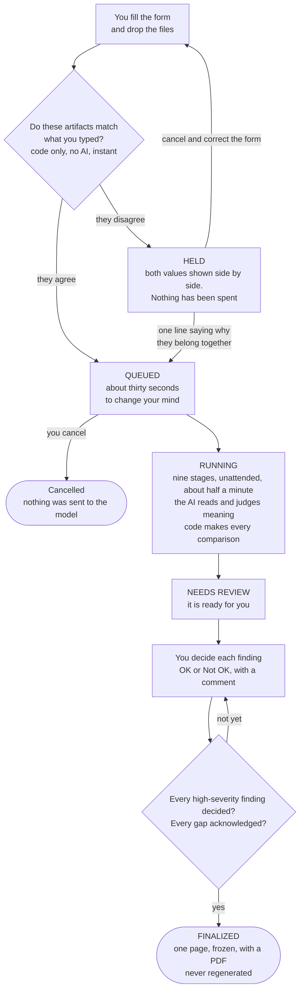
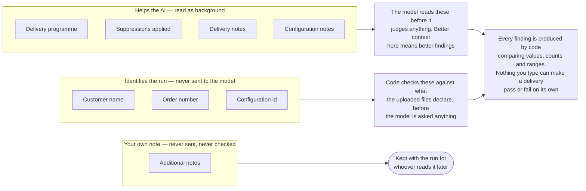
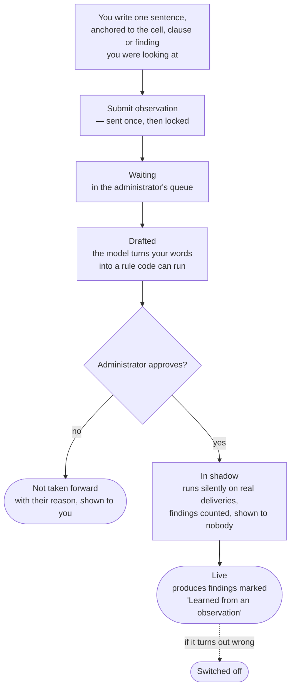

# Greenlight AI — User training

**Audience:** associates who validate deliveries. **Covers:** the user app at
`http://<host>:3000`. **Last aligned with the code:** 2026-09-20, after Phase 6.19 parts A and C.

This document is kept current as a matter of process: `docs/phase-6.5.md` requires it
to be re-read against the product after every major milestone, and `CLAUDE.md` asks
for a check roughly every ten commits. If a screen does not match what is written
here, the document is wrong and should be fixed in the same change as the screen.

<!-- guide 1: What the tool is doing for you -->
## What the tool does, in one paragraph

You upload the order's requirement spec (the **OSL**, a Word document), the ETL
configuration (JSON), and the output reports (Excel). The tool reads the OSL, works
out what it requires, traces each requirement into the configuration and then into
the reports, and shows you a list of **findings**: places where the three disagree.
The model reads and judges meaning; every comparison of values, counts, and ranges is
done by code, so a finding is exact and repeatable. You decide each finding, OK or Not
OK, and generate a frozen one-page report with a PDF.

## The journey of a run, end to end

Before the screen-by-screen detail, here is the whole thing in order. Nothing in the
middle needs you: the only two moments that do are the beginning and the end.

**Who does what.** You describe the delivery and you judge the findings. The tool reads
three documents you would otherwise hold in your head, and tells you where they
disagree. It never decides whether a delivery is acceptable — that has your name on it.

## Where what you type actually goes

Every box on the form carries a small marker under it saying what it does. They are not
tips — they do not disappear when somebody switches help off — because what a field does
to a run is a fact you are entitled to before you decide how much care to take over it.

Two things follow from this, and they are the whole reason the markers exist:

- **A field marked *Helps the AI* is worth writing carefully.** It is background the
  model reads before it forms an opinion. A sentence like "the score column is the V3
  score, not the bureau score" changes what it pays attention to. A wrong one misleads
  it just as effectively.
- **Nothing you write can make a delivery pass or fail.** Findings come from code
  comparing the three documents. Your notes change what the model *understands*, never
  what the tool *decides*.

<!-- guide 2: What matters most from you -->
## What matters most from you

Most of the form is identification: it labels the run so somebody can find it again.
Three things change what the tool finds, and they are worth real care.

1. **The delivery programme.** It decides which rules apply and what the tool expects
   to see. Get it wrong and you will either be shown findings that were never relevant
   to this delivery, or miss the ones that were. If the list does not obviously contain
   your delivery, ask rather than guess — and the tool reads the artifacts a second time
   to check they look like the programme you chose, so a mismatch is usually caught.
2. **The delivery notes.** One sentence of context here improves what the tool finds
   more than anything else you can type. It is read as background, never as a
   requirement, so it cannot make a delivery pass — it helps the tool understand what
   it is looking at. *"The state list was cut to four states at the customer's request
   on the 14th"* saves a reviewer three findings and a phone call.
3. **The right files.** The tool checks the configuration id, the customer and the
   credit date against what the artifacts themselves say, before it starts, and holds
   the run when they disagree. That check costs nothing and catches the expensive
   mistake, but it can only compare what you gave it: the wrong report for the right
   order still looks consistent.

Everything else on the form — the order number, your own reference — identifies the run
and is never sent to the model. The marker under each box says which kind it is.

<!-- guide 3: When the tool is unsure -->
## Three different things are called "review"

The word does three jobs in this tool, and mixing them up is the commonest confusion.

| Where you see it | What it means |
| --- | --- |
| **Needs review** — a run's status | The pipeline has finished and the findings are waiting for you. It is not a verdict; it is "your turn". |
| **review** — a finding's severity | The tool is *not confident* about this one. Something did not extract cleanly, or a second reading disagreed with the first. It is asking you to look, not telling you something is wrong. Treat it as a question. |
| **Reviewing findings** — what you do | Deciding each finding OK or Not OK, with a comment. This is the judgement the whole tool exists to support. |

The middle row is the one worth remembering: **a `review` severity is the tool being
honest about uncertainty, not an accusation.** A finding it is sure about is high,
medium or low. A finding it is unsure about says so rather than guessing, because a
confident wrong answer costs more than an admitted doubt.

## Signing in

Login may be off or on, depending on how the deployment is configured.

- **Off:** there is no prompt. Everything you do is recorded against a placeholder
  account named John Doe, which reads as "login was not enabled".
- **On:** an administrator creates your account and gives you a first password. **You
  must change it the first time you sign in**, because a password someone else typed
  is known to two people. Five wrong attempts lock the account for fifteen minutes.
  A session lasts a working day and ends after an hour idle.

## The sidebar

At the top-left is the Greenlight AI logo, a traffic signal with the green lit,
beside the name and a small **User** chip; the admin console shows **Admin**. Clicking either takes you home. The same mark is the browser tab
icon.

The look of the app is one of four palettes. **Out of the box the theme is locked**,
so everyone reviewing a delivery is looking at the same colours and no picker is
shown. An administrator can unlock it under Appearance in the admin console; when
they do, the **theme picker** appears at the foot of the sidebar and steps through
the palettes with ‹ and ›. Stop on the one you want and the choice is remembered in
this browser. The sun/moon button switches the current palette between its light and
dark variants.

Under the Greenlight AI mark is a status line, and its dot breathes gently while the mode is on: **Train AI mode on** with a green dot, or
**Train AI mode off** with a grey dot. When it is on, some controls exist that do not
otherwise, and each carries a small **Train AI** tag. Everything you type into a tagged
control is recorded and reviewed by an administrator before it changes anything. See
"Train AI mode" below.

The **Admin console** link opens the administrator app in a new tab. If you are not an
administrator you can still open it, but nothing in it will let you change anything.

## Messages, and when the tool is away

- **A coloured bar at the top of the page** is a message an administrator scheduled —
  blue for information, amber for a warning, red for something urgent. It is not
  dismissible: a notice somebody scheduled is one they wanted seen. It takes itself
  down when its end date passes, and it appears in a tab you left open all afternoon
  without you refreshing.
- **A maintenance page instead of the app** means an administrator has taken something
  down deliberately — the model endpoint or the database. The page says so and checks
  for itself, so the app comes back on its own and nobody has to tell you to refresh.
- **"Greenlight AI is not accepting submissions at the moment"** on the new-run form
  means submissions are paused but the rest of the app works: you can still read and
  review runs that already exist.
- **A queue that is not moving** while everything else works means an administrator has
  held the release queue. Your run is safe and queued; it starts when they let it.

## Help on a screen

The small **?** beside a heading or a field opens a short note on what that surface is
for and how it is meant to be used. **Click anywhere to close it** — the ? itself, the
note, or anywhere else on the page. An administrator can switch these off once a team
knows the product; the markers under the form fields are not help and never disappear.

## Submitting a run

**Runs → New run.**

1. **Run details.** Customer name, order number, the **credit date**, and the
   **Configuration ID**, which is the order's ETL configuration number, the Solution
   Canvas config number. It is required and it repeats: the same configuration is
   run again months later, and the **credit date** and the run date, shown beside
   it on the run list and the run page, tell those runs apart. Every run still gets
   its own id. The credit date is the as-of date of the credit data; the tool checks
   that the reports carry it and raises a finding when they do not.
   Choose the **delivery programme**: Account Monitoring, Account Solicitation,
   Archives, or Other. Choose carefully: the tool checks that your inputs read like
   that programme and raises a finding if they do not, and it holds the delivery to
   the programme's rules. It checks this in two passes, so **writing about your work in
   your own words is not a problem**: first it looks for the programme's known words,
   forgiving plurals, hyphens and reordered phrases; only if it finds none does it read
   the documents properly to see what they describe. If that reading agrees with you,
   the tool says nothing and quietly offers your wording to your administrator so it
   matches next time without being asked. Say whether **suppressions were applied**; the default is No,
   because assuming Yes would let a missing suppression pass unremarked.
2. **Delivery notes** (optional). Anything about this delivery the OSL does not
   say. **Every field on the form says whether the model sees it** — the small marker under the box. The delivery programme is the one to read: it is background for everything the model does, it brings in that programme's rules, and code checks your documents really do read like it. Customer, order,
   configuration id, and additional notes stay with the run and are never sent to
   the model. The programme, its rules, the suppressions answer, configuration notes,
   and delivery notes reach the model as background. Accurate notes there improve
   the validation; an inaccurate one misleads it.
3. **Configuration notes.** Once you type a configuration id, any standing notes on
   that configuration appear under the field, with who wrote them. You can add one.
   A note is background for the model on every future run of that configuration; it
   never makes anything pass or fail on its own. Write one when you know something
   about this configuration that the OSL does not say.
4. **Input files.** The OSL (Word or PDF) and the configuration are required. Upload at least one
   report. The report slots you see are whatever an administrator has enabled; a
   type that is switched off simply does not appear.
   - **Several files for one report type.** Some campaigns deliver one field
     distribution per segment. Use **Add another file** on the slot and give each
     file a short label, such as "north" or "segment B". A finding names the file it
     came from, so "the field distribution is wrong" is never all you are told.
   - **Not sure what a workbook is?** Drop it into any slot and the tool compares
     its sheet names and headers with the samples an administrator has stored. When
     it is confident it offers to move the file to the right slot; when it is not, it
     shows the candidates and asks. It never moves a file without your say-so.
5. **Submit.** The tool hashes every file. If the same inputs were already run, it
   shows you that run and asks for a reason before running again, because a second
   identical run costs model calls and produces the same answer.

Some limits are set by an administrator and apply at once: how many runs may be
queued for one order number, and how many runs may start in a five-minute window. If
you hit one, the message says so and asks you to try again shortly.

## When a run is held

Before a single question is put to the model, code compares what you typed with what
the files themselves declare. An ETL configuration carries its own configuration number
and the customer it was built for; the reports carry the credit date. If any of those
disagree with the form, the run **stops and waits** instead of validating thoroughly
against the wrong premise.

The run page shows both values side by side — what you typed, what the file says. You
have two ways out, and neither costs a re-upload:

- **They do belong together.** Say so in one line and press continue. Four common
  reasons are a single click. The run carries on from there, and the waiver stays on
  the page and is printed on the final report, so whoever signs it can see the question
  was asked and who answered it.
- **The form was wrong.** Cancel and correct it.

Anyone who can submit a run can clear a hold. Who ought to be asked first is a question
for your delivery process, not something the tool decides.

**Nothing has been spent at this point.** The files are stored, no model call has been
made, and a held run that is cancelled costs nothing.

## Changing your mind

A submitted run waits about thirty seconds in the queue before the worker may pick it
up, and during that window the run page offers **Cancel this run**. Nothing has been
sent to the model yet, so cancelling is free and keeps your place in nobody's way. The
exact length is set by your administrator.

After that window the run is under way and the button is gone.

## Watching a run

**Runs** lists every run with its status, who submitted it, and its queue position
while it waits. A run moves through nine stages; the run page shows which stage it is
on and refreshes itself. **Needs review** means it is ready for you.

**Finding one run among many.** The search box matches the order number, the customer,
the configuration id and **who submitted it**, and the box beside it filters to one
person. If you arrived from a link in the admin console the list is already showing one
person's runs and says so — *Show everyone* clears it.

**When a run fails.** The list gives you the first few words, because a whole message
would stretch the row. Open the run for the rest, and for **Technical detail** — the
stage it failed at, which attempt it was, and the traceback. That block exists to be
copied: if you are reporting the failure, send it, and whoever picks it up will not have
to ask you to reproduce it.

## Explore a sample

**Explore a sample** shows an example of every artifact the tool accepts: a report
workbook cell by cell with the label beside each one, an OSL by section, a
configuration by JSON path. Values are masked exactly as they are on a real run.

It is there for two reasons. One is to see what the tool is reading. The other matters
more: with Train AI mode on, every cell, section and path has a **What should this
check?** button, so you can tell the tool about something it has never raised. Until
now you could only do that from a finding, which meant you could only talk about what
the tool had already noticed — and what you know is usually about what it said nothing
about.

<!-- guide 4: How to read a finding, and how to decide -->
## Reviewing findings

The run page shows the **traceability matrix** and the **findings**, worst first.

- Each finding has a **severity** (high, medium, low, or review), a title that says
  what disagrees with what, the evidence from all three artefacts side by side, and
  an OK / Not OK decision with a comment.
- There are three decisions. **False positive** means the finding is not a real
  problem. **Accepted risk** means it is real and the delivery goes ahead anyway, and
  it always needs a comment saying why. **Not OK** means the delivery has to change,
  and on a high or review finding it needs a comment too. The tool says so before it
  records anything, so nothing you typed is lost.
- Low-severity findings can be marked OK in bulk, as false positives. High-severity
  ones never can: every one must be decided by hand before the report can be generated.
- **Generate final report asks once**, showing the finding counts and reminding you
  that freezing is permanent: the report is stored once, never regenerated, and the
  findings can no longer be re-reviewed.

<!-- guide 5: How to tell a clean delivery from an unexamined one -->
## What was checked

Above the findings is a panel headed **What was checked**. It exists because a short
findings list cannot tell a clean delivery from one nobody examined, and that is how a
compliance requirement slips through: nothing disagreed with it because nothing was
compared against it.

- Every requirement is in one of four states. **Checked against a report** means a
  check compared it with the delivery. **Traced, no report evidenced it** means it
  reached the configuration and no report shows it was applied. **Not traced** means
  nothing implements it, which is already a finding. **Verified by hand** means no
  check can express it, or the check for it could not be run.
- The panel also warns when a report arrived and **no check examined it**, which
  usually means that report type has no guide, meaning entry or named value yet.
- **"Declared as X; some words point to Y"** is the tool saying it is unsure which
  programme this delivery is, not that you were wrong. It appears when none of your
  programme's usual words are in the documents and a few of another programme's are —
  which happens honestly, for instance when a solicitation says it excludes existing
  accounts. Confirm the programme is right and mark it OK; if it keeps happening for a
  customer, ask your administrator to add that customer's wording to the programme.
- **Notices** appear here too: a second opinion the model could not give, a programme
  reading that did not run. They are not findings, and you should know about them.
- Every requirement nothing evidenced, and every check that could not be evaluated,
  needs **I have seen this** before the report can be frozen. That is not you saying
  the delivery is fine. It is the record that the gap was in front of you, and it goes
  into the frozen report with your name on it. Add a note if you raised it with
  someone.

If several readers looked at a finding, the evidence panel shows **how it was read**:
each reader, whether it agreed, and why. They each saw the same evidence and none saw
the others.
- If a requirement was extracted wrongly, edit it and press **Re-check**. Only the
  comparison stages re-run; nothing is re-asked of the model that has not changed.
- **Configuration notes given to the model** appear above the findings when the
  configuration had any. This is what the model was told as background; it is
  shown so you can judge a finding knowing the context behind it.
- **Since the previous run** appears when an earlier run of the same configuration
  id was finalized for this customer. It lists Not OK items from last time that are
  back (read these first), findings that are new and findings that went away, and
  what changed in the requirements and the configuration. Compared by code; the
  model is not involved. The same section is frozen into the report.

## Generating the report

**Generate report** is enabled once every high-severity finding is decided. The
report is one page: the header, the summary, the Not OK findings with your comments,
and expandable detail. It is **frozen**: generated once, stored, and never regenerated,
so what you signed off is what stays on record. **Download PDF** gives you the same
page as a file, laid out for paper — tighter leading, the headline figures on one line,
and every collapsed section opened, because a section nobody can click is invisible on
paper. Nothing is left out of the PDF that is on the page.

Because a report is frozen, a change to that layout reaches the reports generated after
it and not the ones already filed. An old PDF looks the way it looked when it was signed. The report names who submitted the run and who finalized it.

## Config history

**Config history** lists every captured configuration by configuration id and
version, with who ran it and when. From here you can copy a configuration into a new
run, and you can read, add, edit, or switch off the **notes** on a configuration.
Editing a note keeps the earlier wording; switching one off stops it applying from the
next run and keeps the text.

## Train AI mode

When the sidebar line is green, the tool is collecting what reviewers know so it can
get better. It is aimed at the senior associates who know a programme well enough to
say what should always be true of it, though anyone may write. Nothing you write here
runs: an administrator reads it, has the model draft a rule from it, and approves that
rule, which then runs silently against real deliveries for a while before it starts
producing findings anyone sees. You will hear back either way.

**My observations** shows exactly which of those boxes yours is in. The chain is read
from the rule itself each time, so it is never out of date.

- **What should this check?** is wherever you form the opinion: on every finding card,
  in the evidence drawer, on every row of the traceability matrix, beside **I have seen
  this** on every coverage gap, and on the run as a whole. Use it when you know something
  the tool did not check, or when a finding fired and you know why it should not have.
  The form asks for one sentence first, then what you expect to see; kind, seriousness
  and scope sit under **Details** with sensible defaults. The control pre-fills what you
  were looking at, shown as chips you can remove, which is what makes your note usable.
- **A coverage gap is the best place to write.** When the panel says a requirement was
  traced but no report evidenced it, the tool is telling you it did not check something.
  If you know what should have been checked, say so there.
- **Findings from learned rules say so.** A card marked **Learned from an observation**
  exists because a colleague wrote a sentence and an administrator approved the rule it
  became; the evidence drawer names the rule. **Rules applied to this run**, above the
  findings, lists every administrator-written, guide, meaning-map and learned rule that
  produced a finding, and names the rules running silently in shadow.
- **You submit it once.** The button says **Submit observation**, and afterwards the
  form shows exactly what you sent, greyed out and no longer editable. That is
  deliberate: an administrator may already be reading it, and the model may already
  have drafted a rule from it, and neither should change underneath them.
    
  **If you got something wrong**, ask an administrator to **withdraw** it. It leaves
  every screen, you are free to write a fresh one, and the original is kept on the
  record rather than deleted. An administrator can also correct the wording in place
  if it is only a typo.
    
  If the tool answers that **a rule already covers this**, or that a running rule
  **says the opposite**, each rule it names carries a **Say this rule is wrong** button,
  which starts a correction pointed at that rule. That correction is the most useful
  thing you can tell an administrator.
- **My observations** lists what you have written and where it has got to, as a chain:
  **Waiting → Drafted → In shadow → Live**, or **Switched off**, or **Not taken forward**
  with the administrator's reason. Once a rule exists the card names it. The chain is
  read from the rule itself each time, so it is never stale. Configuration notes are not
  listed here: a note
  already reaches the model on every run of its configuration, and it lives on the
  configuration's own screen.
- **Do not paste account numbers, names, or any personal data.** The tool refuses to
  save text that looks like it, and tells you so, because the only moment it can be
  removed is before it is saved.

<!-- guide 6: What it will not catch -->
## What it will not catch

A tool whose limits are written down is trusted correctly rather than uniformly, and a
reviewer who believes it catches everything is the exact failure this product exists to
prevent. So, plainly:

- **It compares three documents. It does not check the world.** If the OSL itself asks
  for the wrong thing, every artifact can agree with it and nothing will be raised.
- **It cannot see what nobody wrote down.** A verbal agreement with the customer, a
  decision in an email, a convention everyone in the team knows — none of it reaches the
  tool unless it is in the OSL, the configuration, or your delivery notes.
- **A requirement no check can express is marked as needing a person**, not silently
  passed. *What was checked* lists those, and they are yours.
- **It reads a sample of rows, not the whole file**, for anything a person's judgement
  would be needed for. Volume checks are done by code over counts; the tool does not
  re-derive every row of a delivery.
- **A finding it is unsure about says so.** Treat a `review` severity as a question. It
  is not the tool hedging on something it knows.
- **Nothing it says is a sign-off.** It reports where three documents disagree. Whether
  the delivery is acceptable has your name on it, not the tool's.

<!-- guide 7: Why your disagreement is worth recording -->
## Why recording your disagreement matters

When you mark a finding a false positive, or say in your own words what the tool should
have expected, that sentence does not stop at your screen. An administrator reads it,
and where it can become a rule the tool drafts one — which then runs **silently** beside
the real checks until there are enough results to know whether it is any good. Only then
can it start producing findings anybody sees.

Two things follow that are worth knowing. Your sentence is worth writing carefully,
because a person will read it and it may end up as a rule. And you find out what happened
to it: your observations screen says whether it became a rule, is still being measured,
or was not taken forward, with the reason.

<!-- guide 8: Why the Admin console link may not be there -->
## Why the Admin console link may not be there

The sidebar offers an **Admin console** link only to accounts that include it. If you do
not see it, your account is a user account: submitting runs and deciding findings is the
whole job, and there is nothing in the console you would be able to change. Ask an
administrator if you think that is wrong — a senior associate who approves what the tool
has learned is usually given the reviewer role as well, which does show the link.

## Things the tool will refuse, and why

| It says | Why |
| --- | --- |
| "at least one output report must be uploaded" | The OSL and configuration alone cannot be validated against anything. |
| "runs are already queued for order …" | One order number cannot fill the queue by resubmission. |
| "… runs have started in the last 5 minutes" | The start-rate limit an administrator set. Try again shortly. |
| "this looks like it contains personal data" | An observation or note carried something like an account number. Remove it and save again. |
| "set a new password before continuing" | Your first sign-in. Change the password you were given. |
| "Greenlight AI is not accepting submissions at the moment" | An administrator has paused submissions. Reading and reviewing existing runs still works. |
| The maintenance page instead of the app | Something the tool depends on is deliberately down. The page checks for itself and the app returns on its own. |
| "its artifacts disagree with what was submitted" | The run is held: what you typed and what the files declare do not match. See **When a run is held**. |

<!-- guide 9: Getting help -->
## Getting help

Your administrator can see every setting, every rule, and every observation in the
admin console. If a finding surprises you, the **Rules** screen there says what made
it fire.

If a run **failed**, open it and copy the **Technical detail** block into your message.
It names the stage and carries the traceback, and it saves the first round of questions.
